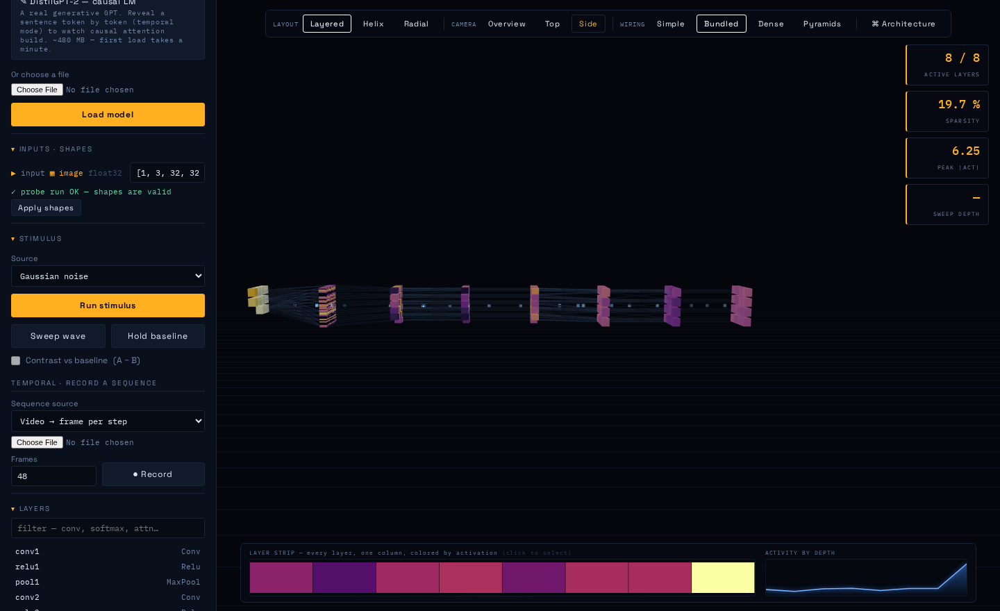
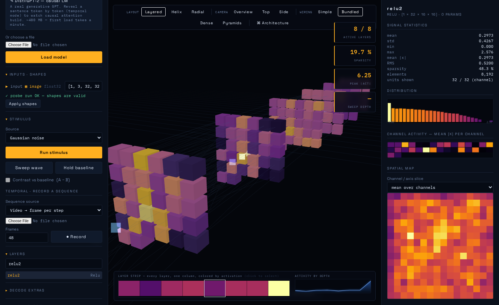
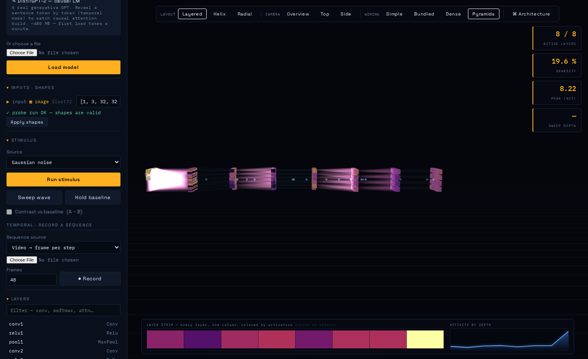
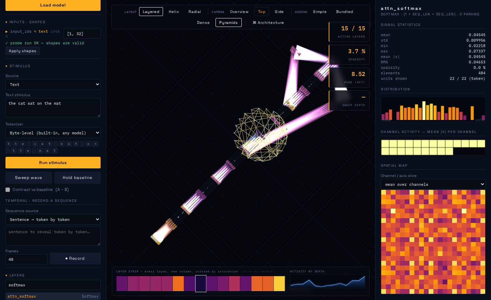
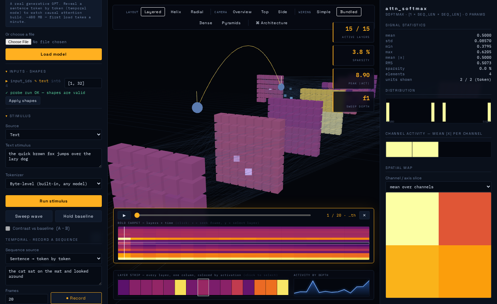
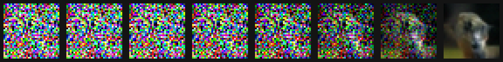
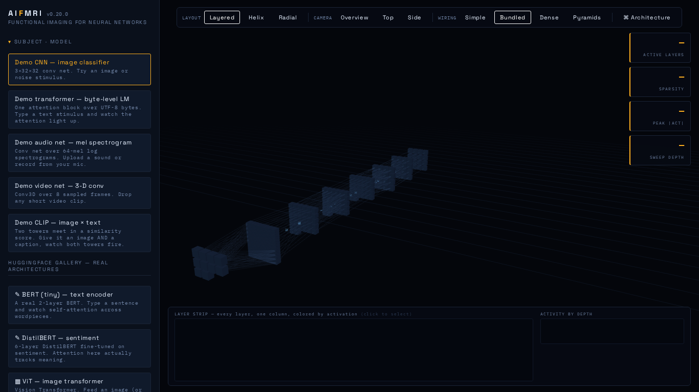
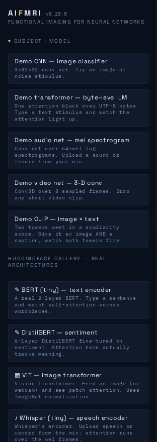

# AIFmri — functional imaging for neural networks

**Version 0.20.0**

AIFmri loads a compiled neural network — an `.onnx` file, a PyTorch `.pt`, a
TensorFlow `.h5` — and renders it in 3D. Feed it a stimulus (an image, a
sentence, a sound, a video, or just noise) and every layer lights up with the
strength of its response, the way an fMRI lights up regions of a brain. From
there you can inspect any layer's raw activations, read out what a layer is
"disposed to say", trace causal circuits, synthesize the input a neuron most
wants, scan the network for dead units, watch a diffusion model denoise, and
more.

It is a single-file web app: a FastAPI backend and a three.js frontend, run
locally, one user, on `localhost`.



*A demo CNN, side-on, responding to a Gaussian-noise stimulus. Each slab is a
layer; each cube is a channel, coloured by mean activation on the inferno
colormap. The top-right counters report active layers, sparsity and peak
activation; the plots along the bottom show the layer strip and activation by
depth.*

---

## Contents

- [Quick start](#quick-start)
- [The core idea](#the-core-idea)
- [Feature tour](#feature-tour) — with screenshots of each
- [The test suite](#the-test-suite) — what it checks and why
- [How it was built](#how-it-was-built) — the version history, honestly
- [API reference](#api-reference)
- [Known limits](#known-limits)

---

## Quick start

1. **Extract the zip somewhere fresh** (not on top of an old copy).
2. **Double-click `START.bat`** (Windows), or run:
   ```bash
   python -m uvicorn app.main:app --port 8001
   ```
3. Open **http://127.0.0.1:8001**.
4. Check the **version badge** next to the title reads the build you expect:

   

   This badge exists for a reason: the single most common confusion during
   development was serving an *old* copy of the app without realising it. If
   the badge does not say `v0.20.0`, you are running stale files.

5. Click **Demo CNN**, set the stimulus to **Gaussian noise**, and press
   **Run stimulus**. The network lights up.

Nothing needs to be downloaded for the five built-in demo models. The optional
HuggingFace gallery (real BERT, ViT, GPT-2, DDPM) needs extra packages — see
[Known limits](#known-limits).

---

## The core idea

Everything in AIFmri converges on a single mechanism. Whatever you load —
PyTorch, TensorFlow, raw ONNX — is converted to ONNX, and then **every
intermediate value in the graph is promoted to a graph output**. One
`onnxruntime` run per stimulus therefore captures the activation of every
layer at once. Each layer becomes an `InstancedMesh` of cubes, one per channel,
coloured by its mean absolute activation.

That one design choice is what makes the rest possible: attention extraction,
the temporal recorder, attribution, circuit tracing and the health scan are all
built on top of "run once, read every layer".

---

## Feature tour

### Loading and stimulating

Load any model and pick a stimulus modality — the app auto-detects whether an
input wants an image, text, audio, video, a diffusion latent, or a scalar
(a diffusion timestep). Multimodal models (CLIP-style) get one stimulus panel
per input.


### The inspector

Click any layer in the 3D view and the right-hand inspector opens with that
layer's statistics, a value histogram, a channel-activity grid, a spatial map,
the raw floats, and — where the layer has weights — a kernel viewer.



### Wiring: Pyramids

By default the connections between layers are drawn as sampled unit-to-unit
lines. **Pyramids** mode goes volumetric instead: a fully-connected layer is
drawn as one open, **square-based pyramid** per source unit — apex on the unit,
square base opening across the whole target slab, i.e. "this unit reaches
everything". The base is square because the target slab is square; overlapping
pyramids, additively blended, build up density where connectivity is dense.



*The glowing volumes fan from each unit onto the next layer. This conveys an
all-to-all connection with one primitive per unit instead of drawing k² lines,
and the fans are tinted by their source layer's activation so they light up
with the network.*

### Attention

For transformers, AIFmri detects attention structurally (a softmax fed by a
Q·Kᵀ matmul) and shows the per-head attention matrix as a heatmap plus
token→token arcs in 3D.



*Attention for "the cat sat on the mat". The arcs connect a ring of token dots;
the heatmap in the inspector is the raw attention matrix. Each query token's
strongest keys are drawn — see the [v0.20 note](#v020--the-bugs-a-real-browser-found)
for why this had to be relative rather than an absolute threshold.*

### Temporal recording — the BOLD carpet

Record activations over a *sequence* of stimuli — a sentence revealed token by
token, a video frame by frame, a noise walk — and scrub through it like a BOLD
sequence. The result is a carpet plot: layers on one axis, time on the other.



### Attribution — activation maximization

Synthesize the input a chosen unit most wants to see, by gradient-free
evolutionary search over input space. The synthesized input is then run back
through the model, so the whole 3D view and inspector repaint to show what the
network does with it.


*The optimization trace (bottom of the inspector) shows the unit's response
climbing as the search proceeds. On the demo CNN this reliably reaches ~16×
the starting activation.*

Alongside maximization, the attribution tools include **occlusion saliency**
(which input regions/tokens matter to a unit) and **stimulus ranking** (which
recorded frame or noise sample fires a unit hardest).

### Network health scan

Probe the model with a batch of varied stimuli and get a report of **dead**,
**weak**, **constant** and **duplicate** units, a dead-percentage profile by
depth, and clickable problem layers.


*Duplicate detection compares activation **patterns**, not magnitudes — an
early magnitude-based version reported 54 duplicate pairs in a layer that had
exactly one, because channels with similar average energy look identical by
that measure.*

### Diffusion mode

A denoising UNet's sequence axis is **noise level**, which is exactly what the
temporal carpet was built for. Load a diffusion model, choose **Denoising
loop**, and AIFmri runs a real DDIM loop from pure noise to a finished image,
recording every layer at every noise level.



*The denoising trajectory of a real trained DDPM-CIFAR10, left (pure noise,
t=999) to right (finished image, t=0). Neighbour-correlation goes from −0.016
to +0.92 — from static to a photograph.*

### Also included

- **Jacobian lens** — reads what a layer is "disposed to say" by transporting
  it through the model's own output head (an ONNX finite-difference adaptation
  of Anthropic's jacobian-lens).
- **Circuit tracing** — perturb a source unit and measure the effect on a
  deeper target (boost→trace), or ablate a layer and measure the change at the
  output (ablate→output).
- **Model diff** — run the same stimulus through two models and compare
  per-layer divergence; localises exactly where two models differ.
- **Weight viewer** — kernel contact sheets, weight histograms, per-filter
  norms.
- **Latency lens** — real per-node ONNX Runtime profiling, honest about
  operator fusion.
- **Session export** — a self-contained HTML report with every image inlined.

---

## The test suite

AIFmri has **114 automated tests that run in about 6 seconds**, plus two opt-in
suites for things that are slow or need a real browser.

```
$ pytest
..........................................................................
..........................................
114 passed, 22 deselected in 5.78s
```

```
$ pytest -m ui          # real-browser reachability (needs playwright + chromium)
$ pytest -m slow        # real HuggingFace models (downloads, needs RAM)
```

### What each module checks

| Module | Tests | What it pins down |
|---|---:|---|
| `test_smoke.py` | 14 | every sample loads and runs; every endpoint answers; modality detection |
| `test_attribution.py` | 18 | occlusion peaks on a known target; **the matched-filter cross-validation** (below) |
| `test_diffusion.py` | 13 | rank-0 timestep loads; latent sizing; the three beta schedules differ; DDIM stays bounded |
| `test_weights_latency_export.py` | 11 | weight stats are finite and sane; latency is fusion-honest; export is self-contained |
| `test_health.py` | 10 | a **sabotaged model** with planted dead/duplicate units is diagnosed exactly |
| `test_attention.py` | 9 | attention detected on transformers, **not** on a CLIP similarity matmul; rows sum to 1 |
| `test_jlens.py` | 8 | the lens reads out the model's real prediction; refuses without a decodable head |
| `test_robustness.py` | 7 | **zero-size intermediates** (the causal-LM bug) reproduced synthetically; LRU eviction |
| `test_diff.py` | 7 | a classifier-head change reads 0.000 upstream and spikes at the Gemm |
| `test_frontend.py` | 7 | `node --check` on the module script; every `$('id')` exists in the DOM |
| `test_circuit.py` | 5 | boosting a source moves the target; ablating hurts less per-channel than whole-layer |
| `test_temporal.py` | 5 | recording reveals tokens progressively; the noise walk stays smooth |
| `test_ui_layout.py` | 14 | **real-browser reachability** at 1280/1366/1500/1920 (opt-in, `-m ui`) |
| `test_gallery_slow.py` | 8 | real BERT/ViT/DDPM; DistilGPT-2 attention is strictly causal (opt-in, `-m slow`) |

### These are not smoke tests

The suite encodes the specific invariants that caught real bugs. Two examples
worth calling out:

**The matched-filter cross-validation.** The activation maximizer is an
evolutionary search that never sees the model's weights; the weight viewer
reads them straight off disk. Matched-filter theory says the input that
maximally excites a first-layer conv filter *is* that filter's own pattern — so
the two features, which share no code, must independently agree. They do, on all
five tested channels. The test also pins *how* to measure it: a naive
average-patch score reports a false failure, because the `mean|activation|`
objective lets the optimum flip sign position-to-position and averaging cancels
exactly the pattern you are looking for.

**The sabotaged-model health scan.** `test_health.py` builds a model with three
conv channels forced dead (huge negative bias) and two filters made
byte-identical, then asserts the scan finds *exactly* three dead units and
*exactly* one duplicate pair, correctly named. This is what pins the
pattern-not-magnitude duplicate detection in place.

---

## How it was built

AIFmri was built iteratively across roughly twenty versions. The honest
version history is useful because several features exist *because* an earlier
assumption turned out to be wrong.

| Version | Added |
|---|---|
| 0.1–0.5 | 3D graph, stimulus modes, inspector, sweep animation, dynamic shape resolution, layouts, architecture view |
| 0.3–0.4 | Multimodality: auto-detect image/text/audio/video, per-input panels, contrast mode |
| 0.6 | Temporal fMRI — record sequences, BOLD carpet, scrub transport |
| 0.7 | Attention flow — per-head heatmaps, token arcs, fused-attention fallback |
| 0.8 | CLIP-normalize presets, one-click HuggingFace gallery |
| 0.9 | Layer stimulus viewer, Jacobian lens |
| 0.10 | Attribution — occlusion saliency, stimulus ranking |
| 0.12 | Model diffing |
| 0.13 | Wiring view — line bundles by op type |
| 0.14 | Pyramids (originally "Cones") — volumetric wiring |
| 0.15 | Activation maximization |
| 0.16 | Network health scan |
| 0.17 | Weight viewer, latency lens, session export, causal-LM fix |
| 0.18 | **The test suite** — and the three bugs it immediately found |
| 0.19 | Diffusion mode |
| 0.19.1–0.19.3 | Deployment fixes: version badge, self-locating launcher, gallery error UX |
| 0.19.2 | "Cones" renamed to Pyramids, square base aligned to the slab |
| 0.20 | **Six bugs a real browser found that 114 tests missed** |

### v0.17 — the causal-LM fix

DistilGPT-2 would not load. The first diagnosis — a KV-cache problem — was
**wrong**. The real cause was that causal-LM exports legitimately produce
*empty* intermediate tensors, and the activation-stats code called numpy
reductions on them, which throws. A one-line guard skipping zero-size arrays
fixed it. DistilGPT-2 now loads all 1366 layers, and its attention comes out
strictly lower-triangular (upper-triangle mass exactly 0.000000) — the causal
mask emerging from the data, with nothing in the code assuming it.

### v0.18 — the test suite found three real bugs on its first run

Writing the tests immediately surfaced: a `/jlens/stack` endpoint that silently
ignored a parameter the frontend was already sending; a model registry that
**never evicted anything**, so loading a few large models would exhaust memory;
and a health scan that held per-unit signatures for every node at once. All
three were fixed, with regression tests. (A day later, the eviction fix itself
was found to break model-diffing — it evicted the model you wanted to compare
against — and was fixed to always spare the two most-recent models.)

### v0.20 — the bugs a real browser found

A browser agent drove the actual UI for ten minutes and found six issues that
all 114 automated tests had passed. The instructive part is *why* they were
missed.

- **Whole control groups were unclickable.** The floating bars were centred on
  the *window*, so at ≤1500px — a laptop screen — the LAYOUT group and the
  carpet's play button slid under the 312px-wide left rail, which sat on top and
  swallowed the clicks. Two earlier fixes colliding. The bars now centre on the
  gap between the rails.
- **Stale readouts after switching models** — the HUD update early-returned
  when there was no activation, leaving the previous model's counters on screen.
- **Attention arcs never rendered on a real sentence** — the arc cutoff was
  absolute (`weight > 0.08`), but attention rows are a softmax summing to 1, so
  at 22 tokens the mean weight is 0.045 and *no* arcs were drawn. It only worked
  under ~12 tokens, which is exactly the length every test used.
- **Camera zoom could lock up** and **camera presets never fully arrived**.

**Why 114 tests missed all of it:** the automated tests clicked with
`force=True`, which tells Playwright to skip its overlap check — a real mouse
cannot force-click — and they ran at 1600px+, where the layout bug does not
occur. Two blind spots stacked.

The lesson is now permanent as `pytest -m ui` (`test_ui_layout.py`), which
drives a real browser at multiple laptop widths, **never** uses force, and
asserts reachability with `document.elementFromPoint` — "is this control the
element the mouse would actually hit?"



*At 1366px the full view bar (LAYOUT · CAMERA · WIRING · Architecture) sits
entirely in the gap to the right of the left rail — the layout the UI tests now
guard at every laptop width.*

---

## API reference

The frontend talks to a small REST API. The main endpoints:

**Loading**
- `POST /api/models` — upload a model file
- `POST /api/samples/{name}` — load a built-in demo
- `POST /api/hf/{name}` — load a HuggingFace gallery model
- `GET /api/samples`, `GET /api/hf`, `GET /api/models` — list
- `GET /api/version` — the running build number

**Stimulating and reading**
- `POST /api/models/{id}/run` — run one stimulus
- `POST /api/models/{id}/run_multi` — multimodal stimulus
- `GET /api/models/{id}/stats?node=` — one layer's statistics
- `GET /api/models/{id}/raw?node=` — raw floats
- `GET /api/models/{id}/spatial?node=` — spatial activation map
- `POST /api/models/{id}/tokenizer`, `POST /api/models/{id}/labels`

**Temporal**
- `POST /api/models/{id}/record` — record a sequence (modes include `denoise`)
- `POST /api/models/{id}/record/seek` — re-run one frame at full fidelity

**Analysis**
- `GET /api/models/{id}/attention?node=`
- `GET /api/models/{id}/jlens?node=` and `/jlens/stack`
- `GET /api/models/{id}/attribution/occlusion|rank_frames|rank_noise`
- `POST /api/models/{id}/attribution/maximize`
- `GET /api/models/{id}/circuit/targets|trace|ablate`
- `GET /api/diff?model_a=&model_b=`
- `GET /api/models/{id}/health`
- `GET /api/models/{id}/weights` and `/weights/image`
- `GET /api/models/{id}/latency`
- `POST /api/models/{id}/export`

---

## Known limits

These are deliberate, not bugs:

- **The HuggingFace gallery needs extra packages.** Without them the gallery
  buttons are disabled and a banner shows the exact `pip install` command. The
  demo samples need none of it.
  ```
  pip install transformers optimum optimum-onnx onnxscript
  # and for the DDPM diffusion entry:
  pip install diffusers
  ```

  
- **The Jacobian lens and circuit tracer are RAM-bound.** They rebuild a
  forward subgraph in memory, costing ~5× the model size (measured). On a model
  too large for available RAM they refuse cleanly rather than crash. Everything
  else works at any size.
- **Fused/Flash attention can't yield a Q·Kᵀ matrix** — the kernel never
  materialises it. AIFmri flags this and falls back to per-token output energy.
- **Text maximization is weaker than image maximization** (~2× vs ~16×);
  discrete search over tokens is genuinely harder than continuous search over
  pixels.
- **Full Stable Diffusion is a pipeline** (text encoder → UNet → VAE) and
  AIFmri loads one graph at a time. You can inspect the UNet — where the
  interesting computation is — but there is no text prompt and no VAE decode.
- **A model with external weights** (`model.onnx.data` beside the `.onnx`) must
  be loaded from disk, not uploaded through the browser.

---

*Generated for AIFmri v0.20.0. All UI screenshots are of the current build;
the version badge visible in several of them reads v0.20.0.*
