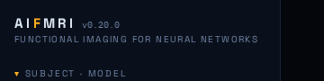
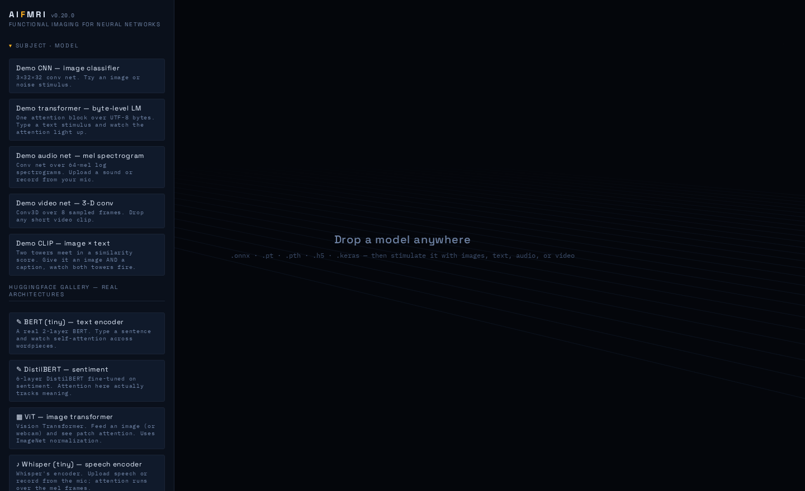
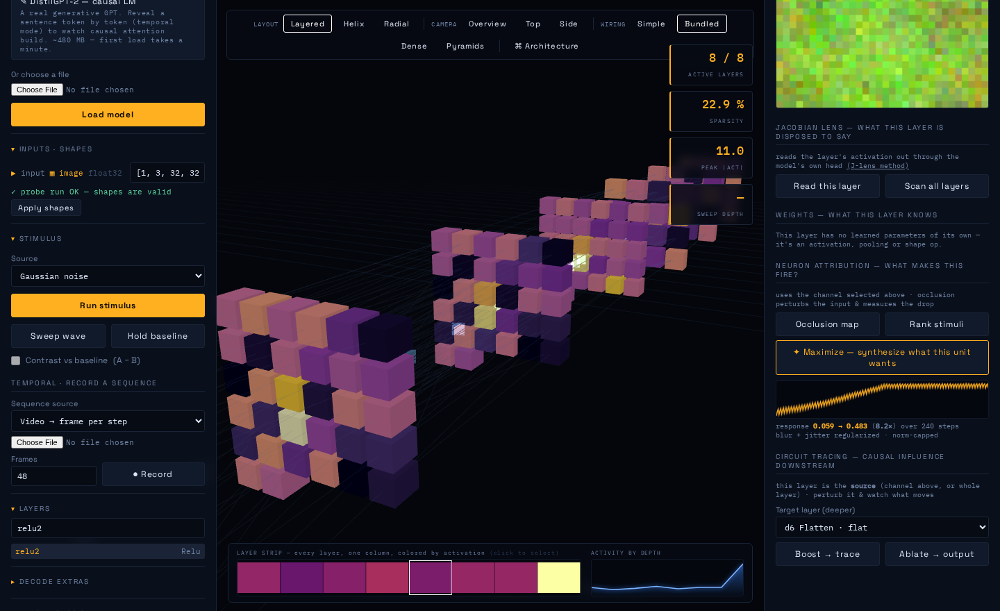
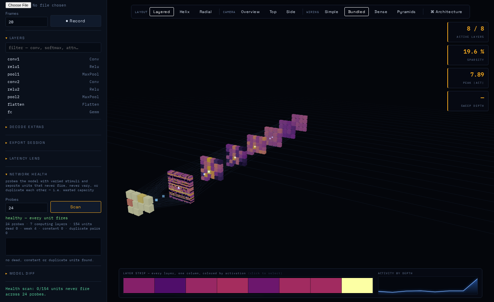

# AIFmri — functional imaging for neural networks

**v0.20.0** · [github.com/ezducate/aifmri](https://github.com/ezducate/aifmri)

AIFmri loads a compiled neural network — an `.onnx`, a PyTorch `.pt`, a
TensorFlow `.h5` — and renders it in 3D. Feed it a stimulus (an image, a
sentence, a sound, a video, or just noise) and every layer lights up with the
strength of its response, the way an fMRI lights up regions of a brain.

From there you can inspect any layer's activations, read out what a layer is
*disposed to say*, trace causal circuits between layers, synthesize the input a
neuron most wants, scan the network for wasted capacity, diff two checkpoints,
and watch a diffusion model denoise.

It's a single-user local web app: FastAPI backend, three.js frontend, no cloud,
no accounts, nothing leaves your machine.


*A demo CNN, side-on, responding to Gaussian noise. Each slab is a layer, each
cube a channel, coloured by mean activation on the inferno colormap. Top-right
counters show active layers / sparsity / peak activation; the plots along the
bottom are the layer strip and activation-by-depth.*

---

## Contents

- [Install and run](#install-and-run)
- [The core idea](#the-core-idea)
- [The fMRI toolkit](#the-fmri-toolkit)
- [Wiring view](#wiring-view)
- [Attention](#attention)
- [Temporal recording — the BOLD carpet](#temporal-recording--the-bold-carpet)
- [Jacobian lens](#jacobian-lens--what-a-layer-is-disposed-to-say)
- [Neuron attribution](#neuron-attribution--what-makes-a-unit-fire)
- [Activation maximization](#activation-maximization--ask-the-neuron-what-it-wants)
- [Circuit tracing](#circuit-tracing--causal-influence-between-layers)
- [Model diffing](#model-diffing--what-did-the-fine-tune-change)
- [Network health scan](#network-health-scan--is-the-model-wasting-capacity)
- [Weights, latency, export](#weights-latency-and-export)
- [Causal language models](#causal-language-models)
- [Diffusion mode](#diffusion-mode)
- [Tests](#tests)
- [How it was built](#how-it-was-built)
- [API](#api)
- [Known limits](#known-limits)

---

## Install and run

### Option A — clone the repo

```bash
git clone https://github.com/ezducate/aifmri.git
cd aifmri
pip install -r requirements.txt
python -m uvicorn app.main:app --port 8001
```

### Option B — download the zip

Grab the ZIP from the repo (**Code ▸ Download ZIP**, or a tagged release),
extract it **to a fresh folder**, then:

```bash
cd aifmri-main
pip install -r requirements.txt
python -m uvicorn app.main:app --port 8001
```

### Windows

Double-click **`START.bat`**. It changes to its own folder first — so it can
never accidentally serve an older copy that happens to be your current
directory — and picks an interpreter by actually running `import app.main`,
which is the only honest test of "can this Python run AIFmri". If nothing on
the machine can, it prints exactly what's missing and the `pip` line to fix it.

> Port 8000 is often reserved by Hyper-V/WSL on Windows, so the default here is
> **8001**.

### Then

Open **http://127.0.0.1:8001** and check the **version badge** next to the
title:



That badge exists because the single most common confusion during development
was serving a *stale copy* of the app without realising it. If it doesn't read
`v0.20.0`, you're running old files. There's also `GET /api/version`.

Now click **Demo CNN**, set the stimulus to **Gaussian noise**, and hit **Run
stimulus**. The network lights up. Five demo models are built in and need no
downloads.



### Optional extras

Everything above works with the base requirements. These unlock more:

```bash
# One-click HuggingFace gallery (real BERT, DistilBERT, ViT, Whisper, GPT-2)
pip install transformers optimum optimum-onnx onnxscript

# The DDPM diffusion gallery entry
pip install diffusers

# .pt / .pth checkpoints
pip install torch torchvision

# .h5 / .keras / SavedModel
pip install tensorflow tf2onnx

# Tests
pip install pytest
# ...and for the real-browser UI tests:
pip install playwright && playwright install chromium
```

If the exporter packages are missing, the gallery says so up front — a banner
with the exact `pip` command, and the buttons disabled — rather than failing
silently when you click.


---

## The core idea

Everything converges on one mechanism. Whatever you load — PyTorch,
TensorFlow, raw ONNX — is converted to ONNX, and then **every intermediate
value in the graph is promoted to a graph output**. A single `onnxruntime` run
per stimulus therefore captures the activation of *every* layer at once. Each
layer becomes an `InstancedMesh` of cubes, one per channel, coloured by mean
absolute activation.

That one choice is what makes the rest possible: attention extraction, temporal
recording, attribution, circuit tracing and the health scan are all built on
"run once, read every layer".

---

## The fMRI toolkit

* **Image normalization presets** — unit (0…1), ImageNet, **CLIP / OpenAI**,
  Inception, and signed (−1…1), so real vision checkpoints get the exact
  preprocessing they expect.
* **Any modality** — the model's input signature is auto-classified as
  text / image / audio / video / latent / scalar / tensor (dtype + rank + shape
  + name heuristics), and the stimulus panel switches to match:
  - **Image** — file upload, drag-and-drop, or a one-click webcam snapshot.
  - **Text** — tokenized via a HF `tokenizer.json` or the built-in byte
    tokenizer; masks and token types auto-generated.
  - **Audio** — wav/flac/ogg/mp3 upload or a 4-second mic recording (encoded to
    WAV in the browser). Fitted automatically to what the model wants: raw
    waveform, or log-mel spectrogram with mel bins / frame count read from the
    input shape. Whisper-style `(1, 80, 3000)` is recognized.
  - **Video** — any clip; frames sampled evenly to the model's time axis,
    fitted to NCTHW / NTCHW / NTHWC layouts.
  - Plus Gaussian noise and zeros baselines for any input.
* **Multimodal models** (CLIP-style, image × text): inputs split into *stimulus
  inputs* — each with its own card, mode, file or text — and *companions*
  (attention masks, token types, position ids) which are auto-filled and follow
  the dynamic shape of the input they belong to.
* **Contrast mode** — hold a run as baseline, run a second stimulus, view A − B
  on a diverging coolwarm map. This is how real fMRI works: activation is
  always relative to a baseline condition. Pair it with multimodal input: hold
  a baseline, change only the caption, see which layers carry the text signal.
* **Sweep** — animate the activation wave through the network front-to-back.
* **Inspector** — per-layer stats (mean/std/sparsity/RMS), per-channel spatial
  heatmaps (token × dim for transformers), paginated raw floats,
  render-any-tensor-as-image, and logits → top-k labels.


---

## Wiring view

Connections between layers are drawn as *sampled* unit-to-unit lines — never
all of them, since a Gemm between two 512-unit layers is 262,144 edges. Modes:
**Simple** (one edge), **Bundled** (default), **Dense**, and **Pyramids**.

**Pyramids** goes volumetric instead of linear. A fully-connected layer is drawn
as one open, **square-based pyramid** per sampled source unit — apex on the
unit, square base opening across the whole target slab: *this unit reaches
everything*. The base is square because the target slab is square; the geometry
is rolled 45° so the base's edges line up with the slab rather than sitting on
it as a diamond. Additively blended, overlapping pyramids build density where
connectivity is dense — an all-to-all Gemm with one primitive per unit instead
of k² lines. Conv/pool get the mirror image: a narrow pyramid per *target* unit
opening back onto its receptive field, so locality reads as a tight beam and
density as a wide glow.


The fans are tinted by their source layer's activation, so the wiring lights up
with the network.

---

## Attention

For transformers, attention is detected **structurally** — a softmax whose
score chain traces back to a Q·Kᵀ matmul — not by name matching. The inspector
shows the per-head attention matrix as a heatmap with a head selector and token
list; the 3D view draws token→token arcs over a ring of token dots.


*Attention for "the cat sat on the mat".*

Each query token contributes its strongest keys, with a floor relative to that
row's own maximum. That relative rule matters: an earlier absolute cutoff
(`weight > 0.08`) silently drew **zero arcs** on any real sentence, because
attention rows are a softmax summing to 1 — at 22 tokens the mean weight is
0.045. See [v0.20](#v020--six-bugs-a-real-browser-found).

**Fused / Flash attention** is flagged and falls back to per-token output
energy. Those kernels never materialize the Q·Kᵀ matrix, so it cannot be
recovered — the tool says so rather than fabricating a heatmap.

---

## Temporal recording — the BOLD carpet

Record activations over a *sequence* of stimuli and scrub through it. Sources:
a sentence revealed token by token, a video frame by frame, an audio sliding
window, a noise walk (slerp between seeds), or a diffusion denoising loop.

The result is a carpet plot — layers on one axis, time on the other — with a
play/scrub transport. Click any cell to seek to that frame *and* select that
layer.


Attention is captured per frame too, so you can watch the attention matrix grow
as more tokens are revealed.

---

## Jacobian lens — what a layer is disposed to say

An ONNX finite-difference adaptation of Anthropic's
[jacobian-lens](https://github.com/anthropics/jacobian-lens). It transports a
mid-network layer through the model's *own* output head to read what that layer
is currently disposed to predict — the layer's "opinion", in the model's own
vocabulary.

It **refuses** when the model has no decodable head: if the final output is a
feature/hidden vector rather than a vocabulary or labelled class head, printing
top-k would be nonsense, so it says so instead. Attach a labels file (one ships
at `samples/digit_labels.json`) and it works.

*Validation:* on demo-cnn the lens at mid-depth reads out the digit the model
actually predicts.

---

## Neuron attribution — what makes a unit fire?

* **Occlusion saliency** — slide a patch over the image (or mask each token in
  turn), measure how much the chosen unit drops, and render the result as an
  importance map. Model-agnostic, gradient-free.
* **Stimulus ranking** — score every recorded frame, or a batch of noise
  samples, by how hard they drive the unit, and jump straight to the winner.

*Validation:* on an image whose only structure is a bright square in a known
quadrant, occlusion importance peaks inside that square.

---

## Activation maximization — ask the neuron what it wants

Occlusion asks *"which part of this input matters?"*. Ranking asks *"which of
my inputs fires it hardest?"*. Maximization asks the unit directly: it
**searches input space for the stimulus that drives the unit hardest**, and
synthesizes it.

ONNX graphs aren't autodiff-friendly, so instead of gradient ascent this is an
**NES-style evolutionary search** — sample a population of perturbations, score
each with a forward pass, step along the fitness-weighted direction. A few
hundred forward passes, no gradients, works on any ONNX model.

* **Regularized** — images get blur + jitter during the search, and the input is
  norm-capped. Without regularization the optimizer finds adversarial
  high-frequency noise that maximizes the unit while showing no structure. The
  norm cap does real work too: for a ReLU net, activation scales linearly with
  input scale, so uncapped the search would just crank the input to infinity.
  Capped, it answers the meaningful question — *the most exciting input at a
  fixed energy budget*.
* **Discrete inputs** (token ids) get hill-climbing over vocabulary instead.
* **The result becomes the live stimulus.** The server runs the synthesized
  input, so the 3D view, inspector and stimulus viewer all repaint. Click
  Maximize and the brain is now looking at the neuron's dream.



*Validation:* on demo-cnn, `relu2[3]` climbs **0.067 → 1.098 (16.4×)** in ~1.4s,
and different channels synthesize genuinely different images (mean pixel
difference 17–44) — each unit wants its own thing.

**Cross-validated against the weight viewer.** Matched-filter theory says the
input that maximally excites a first-layer conv filter *is* that filter's own
pattern. The maximizer never sees the weights; the weight viewer reads them
straight off disk. Measured sign-invariantly — per-patch |correlation|, because
the `mean|activation|` objective lets the optimum flip sign position-to-position
— **all 5 tested channels match their own filter**, 1.5–1.6× above any other.
Two independent features agreeing via theory.

---

## Circuit tracing — causal influence between layers

Attribution looks *backwards* (what in the input made this fire). Circuit
tracing looks *forwards*:

* **Boost → trace** — perturb a source unit, re-run the network, and measure
  the per-channel change at a deeper target layer.
* **Ablate → output** — zero a source unit or whole layer and measure the L2
  change in the logits, plus whether the prediction actually flipped.

Targets are restricted to layers genuinely downstream of the source — asking
for an upstream target is refused rather than silently returning noise.

---

## Model diffing — what did the fine-tune change?

Run the same stimulus through two loaded models and compare per-layer
divergence (relative L2 + cosine), plus the change at the output.

*Validation:* against a clone whose **only** difference is a perturbed
classifier head, every layer upstream reads **0.000** divergence and the change
spikes exactly at the `Gemm`. The tool localises the change to precisely where
it was made.

---

## Network health scan — is the model wasting capacity?

Every other view in AIFmri is single-stimulus. The health scan probes the model
with a **batch of varied stimuli** and aggregates per-unit statistics across
them, which is the only way to see the pathologies that actually bite:

* **dead** — never fires for *any* stimulus (the classic dead ReLU)
* **weak** — fires, but negligibly next to its layer-mates
* **constant** — never varies across stimuli, so carries no information
* **duplicate** — two units whose activation *patterns* are near-perfectly
  correlated: the layer is narrower than it looks



Two details that make it trustworthy rather than decorative:

* **Duplicates compare patterns, not magnitudes.** The first implementation
  correlated each channel's *mean activation* and reported 54 duplicate pairs in
  a layer that had exactly 1 — channels with similar average energy look alike
  by that measure. Correlating each unit's actual activation *pattern* across
  the probe batch fixed it.
* **Structural ops are skipped.** Flatten/Reshape/Transpose have no units of
  their own — they're views of the previous layer, so "dead units" there is a
  meaningless restatement. Excluding them removed the last false positives.

*Validation:* against a model with deliberately sabotaged weights (three conv
channels forced permanently dead via bias, two filters made identical), the scan
reports **exactly 3 dead channels** and **exactly 1 duplicate pair — correctly
identified as the planted pair, correlation 1.0** — while the healthy model
reports **0 dead and 0 duplicates**.

---

## Weights, latency, and export

**Weight viewer.** The rest of the tool shows what the network *does*; this
shows what it *knows*. Per layer: kernel contact sheets (RGB tiles for a
3-channel first layer, inferno mean-maps deeper), weight histograms, and
per-filter norms ranked so a dead or degenerate filter stands out.

**Latency lens.** Real ONNX Runtime per-node profiling — paint the 3D view by
time instead of activation and the bottleneck is obvious. It's honest about
what it can't see: ORT **fuses** ops (on demo-cnn it folds Relu into Conv, and
the report says so rather than claiming "Relu = 41% of runtime" as fact), and
ORT-internal ops are reported separately as overhead rather than blamed on your
layers.

**Session export.** A self-contained HTML report — stimulus, activation
profile, optional health and latency sections, your notes — with every image
base64-inlined and zero external references. It opens offline, forever.

---

## Causal language models

DistilGPT-2 and friends load, run, record, scan and profile. The bug that once
blocked them is worth recording because the **first diagnosis was wrong**: it
was blamed on KV-cache inputs. The real cause is that causal-LM exports
legitimately produce *empty* intermediate tensors, and the activation-stats code
called numpy reductions on them, which throws. A one-line guard skipping
zero-size arrays fixed it.

*Validation:* DistilGPT-2 loads all **1366 layers**, and its attention comes out
**strictly lower-triangular — upper-triangle mass exactly 0.000000**. The causal
mask emerges from the data; nothing in the code assumes it.

---

## Diffusion mode

A denoising UNet's sequence axis is **noise level** — which is exactly what the
temporal carpet was built for. Load a diffusion model, pick **Denoising loop**,
and AIFmri runs a real DDIM loop (eta=0) from pure noise to a finished image,
recording every layer at every step. The carpet's x-axis stops being "time" and
becomes "how noisy is the picture right now", so you can see which layers carry
coarse structure early and which do fine detail late.


*The denoising trajectory of a real trained DDPM-CIFAR10: left is pure noise
(t=999), right is the finished image (t=0). Neighbour-correlation goes from
−0.016 to **+0.92** — from static to a photograph.*

One click: **DDPM (CIFAR-10)** in the gallery is a real trained denoiser
(~143 MB). It ships as a gallery entry because optimum's exporter assumes a text
encoder and unconditional pipelines don't have one, so AIFmri exports the UNet
itself.

Four real gaps had to be closed to get there:

* **A rank-0 timestep crashed the loader.** Nothing else in the zoo has a scalar
  input; modality detection did `shape[-1]` and threw. Scalars are now their own
  modality — a timestep is a knob, not a stimulus.
* **A latent is not an image.** `sample` is `(B,4,H,W)`, and resolving its
  dynamic dims like an image (224) made Stable Diffusion's self-attention ask
  onnxruntime for **5 GB**. Latents resolve to 64×64.
* **The stimulus is the latent**, not the text embedding — and 32-dim
  conditioning was being misread as a mel spectrogram.
* **The noise schedule is not in the ONNX file.** It lives in the pipeline's
  scheduler config, which AIFmri never sees. Guessing wrong is not a small
  error: on a real DDPM the correct `linear` schedule denoises to
  neighbour-correlation **0.91** (a photograph), while Stable Diffusion's
  `scaled_linear` gives **0.29** (still noise). So it's a visible choice in the
  UI, not a hidden default.

---

## Tests

**114 tests in about 6 seconds**, plus two opt-in suites.

```console
$ pytest
..........................................................................
..........................................
114 passed, 22 deselected in 5.78s
```

```bash
pytest              # 114 fast tests
pytest -m ui        # + real-browser reachability (needs playwright + chromium)
pytest -m slow      # + real HuggingFace models (downloads, needs RAM)
```

| Module | Tests | What it pins down |
|---|---:|---|
| `test_smoke.py` | 14 | every sample loads and runs; every endpoint answers; modality detection |
| `test_attribution.py` | 18 | occlusion peaks on a known target; the matched-filter cross-validation |
| `test_diffusion.py` | 13 | rank-0 timestep loads; latent sizing; the three beta schedules differ; DDIM stays bounded |
| `test_weights_latency_export.py` | 11 | weight stats finite and sane; latency is fusion-honest; export is self-contained |
| `test_health.py` | 10 | a **sabotaged model** with planted dead/duplicate units is diagnosed exactly |
| `test_attention.py` | 9 | attention detected on transformers, **not** on a CLIP similarity matmul; rows sum to 1 |
| `test_jlens.py` | 8 | the lens reads out the model's real prediction; refuses without a decodable head |
| `test_robustness.py` | 7 | **zero-size intermediates** (the causal-LM bug) reproduced synthetically; LRU eviction |
| `test_diff.py` | 7 | a classifier-head change reads 0.000 upstream and spikes at the Gemm |
| `test_frontend.py` | 7 | `node --check` on the module script; every `$('id')` exists in the DOM |
| `test_circuit.py` | 5 | boosting a source moves the target; ablating one channel hurts less than the layer |
| `test_temporal.py` | 5 | recording reveals tokens progressively; the noise walk stays smooth |
| `test_ui_layout.py` | 14 | real-browser reachability at 1280/1366/1500/1920 *(opt-in, `-m ui`)* |
| `test_gallery_slow.py` | 8 | real BERT/ViT/DDPM; DistilGPT-2 attention strictly causal *(opt-in, `-m slow`)* |

### These are not smoke tests

They encode the specific invariants that caught real bugs.

**The matched-filter cross-validation.** The maximizer is an evolutionary
search that never sees the weights; the weight viewer reads them off disk.
Theory says they must agree — and they do, 5/5. The test also pins *how* to
measure it, because a naive average-patch score reports a false failure.

**The sabotaged-model health scan.** Three conv channels forced dead, two
filters made byte-identical; the scan must find *exactly* that, correctly named.
This is what holds the pattern-not-magnitude duplicate detection in place.

**The synthetic zero-size tensor.** A hand-built ONNX graph with a legitimately
empty intermediate reproduces the causal-LM bug in milliseconds, instead of a
480 MB download.

---

## How it was built

Roughly twenty versions, iteratively. The honest history is useful, because
several features exist *because* an earlier assumption turned out to be wrong.

| Version | Added |
|---|---|
| 0.1–0.5 | 3D graph, stimulus modes, inspector, sweep, dynamic shape resolution, layouts, architecture view |
| 0.3–0.4 | Multimodality: auto-detected image/text/audio/video, per-input panels, contrast mode |
| 0.6 | Temporal fMRI — sequence recording, BOLD carpet, scrub transport |
| 0.7 | Attention flow — per-head heatmaps, token arcs, fused-attention fallback |
| 0.8 | CLIP-normalize presets, one-click HuggingFace gallery |
| 0.9 | Layer stimulus viewer, Jacobian lens |
| 0.10 | Attribution — occlusion saliency, stimulus ranking |
| 0.11 | Circuit tracing |
| 0.12 | Model diffing |
| 0.13 | Wiring view — line bundles by op type |
| 0.14 | Volumetric wiring (originally "Cones") |
| 0.15 | Activation maximization |
| 0.16 | Network health scan |
| 0.17 | Weight viewer, latency lens, session export, causal-LM fix |
| 0.18 | **The test suite** — and the three bugs it immediately found |
| 0.19 | Diffusion mode |
| 0.19.1–0.19.3 | Version badge, self-locating launcher, gallery error UX |
| 0.19.2 | "Cones" → **Pyramids**, square base aligned to the slab |
| 0.20 | **Six bugs a real browser found that 114 tests missed** |

### v0.18 — the test suite found three real bugs on its first run

Writing the tests immediately surfaced: a `/jlens/stack` endpoint that silently
ignored a parameter the frontend was already sending; a model registry that
**never evicted anything**, so loading a few large models exhausted memory; and
a health scan holding per-unit signatures for every node at once. All three
fixed with regression tests.

A day later the eviction fix itself was found to break model diffing — loading
model B evicted the model you wanted to compare against — and was fixed to
always spare the two most-recent models. That one is now a regression test too.

### v0.20 — six bugs a real browser found

A browser agent drove the actual UI for ten minutes and found six issues that
all 114 automated tests had passed. The instructive part is *why* they were
missed.

* **Whole control groups were unclickable.** The floating bars were centred on
  the *window*, so at ≤1500px — a laptop screen — the LAYOUT group and the
  carpet's play button slid under the 312px left rail, which sat on top and
  swallowed the clicks. Two earlier fixes colliding: the rails had been raised
  in v0.9 to stop the analytics bar eating the inspector's buttons. The bars now
  centre on the **gap between the rails**, and the HUD slides left when the
  inspector opens.
* **Stale readouts after switching models** — the HUD update early-returned when
  there was no activation, leaving the previous model's counters on screen
  describing a network that was no longer loaded.
* **Attention arcs never rendered on a real sentence** — the absolute `w > 0.08`
  cutoff versus a softmax summing to 1. Zero arcs at 22 tokens. It only worked
  under ~12 tokens, which is exactly the length every test used.
* **Camera zoom could lock up permanently** — OrbitControls had no distance
  bounds, so you could dolly onto the target and never zoom back out.
* **Camera presets never fully arrived** — the fly-to lerp stopped at ~94% when
  its timer expired, which is why "Overview" appeared to fix the angle but not
  the distance.

**Why 114 tests missed all of it:** the automated tests clicked with
`force=True`, which tells Playwright to skip its overlap check — a real mouse
cannot force-click — and they ran at 1600px+, where the layout bug does not
occur. Two blind spots stacked.

The lesson is permanent as `pytest -m ui`: a real browser at multiple laptop
widths, **never** forcing, asserting reachability with
`document.elementFromPoint` — *is this control the element the mouse would
actually hit?*


*At 1366px the full view bar sits entirely in the gap right of the left rail —
the layout the UI tests now guard at every laptop width.*

### The recurring lesson

Several bugs came from **measuring the wrong proxy and believing the number**:
duplicate detection by magnitude instead of pattern; phantom dead units in
Flatten layers; a broken patch-average test that scored the maximizer 1/4 when
the correct sign-invariant measure scores 5/5; force-clicked tests at a window
size nobody uses. The habit that fixes it is validating against ground truth —
sabotaged models, planted pathologies, known-answer stimuli — and refusing
"structurally works" as evidence on an untrained model.

---

## API

**Loading**

| Endpoint | Purpose |
|---|---|
| `POST /api/models` | upload a model file |
| `POST /api/models/resolve` | resolve dynamic shapes |
| `POST /api/samples/{name}` | load a built-in demo |
| `POST /api/hf/{name}` | load a HuggingFace gallery model |
| `GET /api/samples` · `GET /api/hf` · `GET /api/models` | list |
| `GET /api/version` | the running build number |

**Stimulating and reading**

| Endpoint | Purpose |
|---|---|
| `POST /api/models/{id}/run` | run one stimulus |
| `POST /api/models/{id}/run_multi` | multimodal stimulus |
| `GET /api/models/{id}/stats?node=` | one layer's statistics |
| `GET /api/models/{id}/raw?node=` | paginated raw floats |
| `GET /api/models/{id}/spatial?node=` | spatial activation map |
| `GET /api/models/{id}/decode/image` · `/decode/topk` | render tensor / top-k labels |
| `POST /api/models/{id}/tokenizer` · `/labels` | attach a tokenizer or class labels |
| `GET /api/models/{id}/stimulus` · `/stimulus/image` · `/stimulus/waveform` | what produced this run |

**Temporal**

| Endpoint | Purpose |
|---|---|
| `POST /api/models/{id}/record` | record a sequence (modes include `denoise`) |
| `POST /api/models/{id}/record/seek` | re-run one frame at full fidelity |

**Analysis**

| Endpoint | Purpose |
|---|---|
| `GET /api/models/{id}/attention?node=` | per-head attention matrix |
| `GET /api/models/{id}/jlens` · `/jlens/stack` | Jacobian lens |
| `GET /api/models/{id}/attribution/occlusion` | saliency map |
| `GET /api/models/{id}/attribution/rank_frames` · `/rank_noise` | stimulus ranking |
| `POST /api/models/{id}/attribution/maximize` | synthesize what a unit wants |
| `GET /api/models/{id}/circuit/targets` · `/trace` · `/ablate` | circuit tracing |
| `GET /api/diff?model_a=&model_b=` | model diffing |
| `GET /api/models/{id}/health` | network health scan |
| `GET /api/models/{id}/weights` · `/weights/image` | weight viewer |
| `GET /api/models/{id}/latency` | per-node profiling |
| `POST /api/models/{id}/export` | self-contained HTML report |

---

## Repo layout

```
app/
  core.py          model ingestion, ONNX conversion, activation capture,
                   attention, temporal, attribution, circuits, health,
                   weights, latency, diffusion  (~2900 lines)
  main.py          FastAPI endpoints
  version.py       single source of the build number
  samples.py       five built-in pure-ONNX demo models
  hf_gallery.py    HuggingFace one-click gallery + diffusion UNet exporter
  static/
    index.html     the entire three.js frontend, one file
tests/             14 test modules + conftest
samples/           shipped label files
docs/images/       the screenshots in this README
START.bat          Windows launcher
```

---

## Known limits

Deliberate, not bugs:

* **The Jacobian lens and circuit tracer are RAM-bound.** They rebuild a forward
  subgraph in memory, costing **~5× the model size** (measured: 4.9× on
  BERT-tiny, 5.2× on ViT-tiny). The guard reads actual free memory and refuses
  cleanly when the job won't fit, rather than OOM-killing the server. Everything
  else works at any size.
* **Fused / Flash attention can't yield a Q·Kᵀ matrix** — the kernel never
  materializes it. Flagged, with a fallback to per-token energy.
* **Text maximization is weaker than image maximization** (~2× vs ~16×);
  discrete search over tokens is genuinely harder than continuous search over
  pixels.
* **Full Stable Diffusion is a pipeline** (text encoder → UNet → VAE) and AIFmri
  loads one graph at a time. You can inspect the UNet — where the interesting
  computation is — but there's no text prompt and no VAE decode.
* **Models with external weights** (`model.onnx.data` beside the `.onnx`) must
  be loaded from disk, not uploaded through the browser.
* **The demo samples have random untrained weights.** Their structure is real;
  their predictions are meaningless. Use the gallery models for anything where
  the output should mean something.
